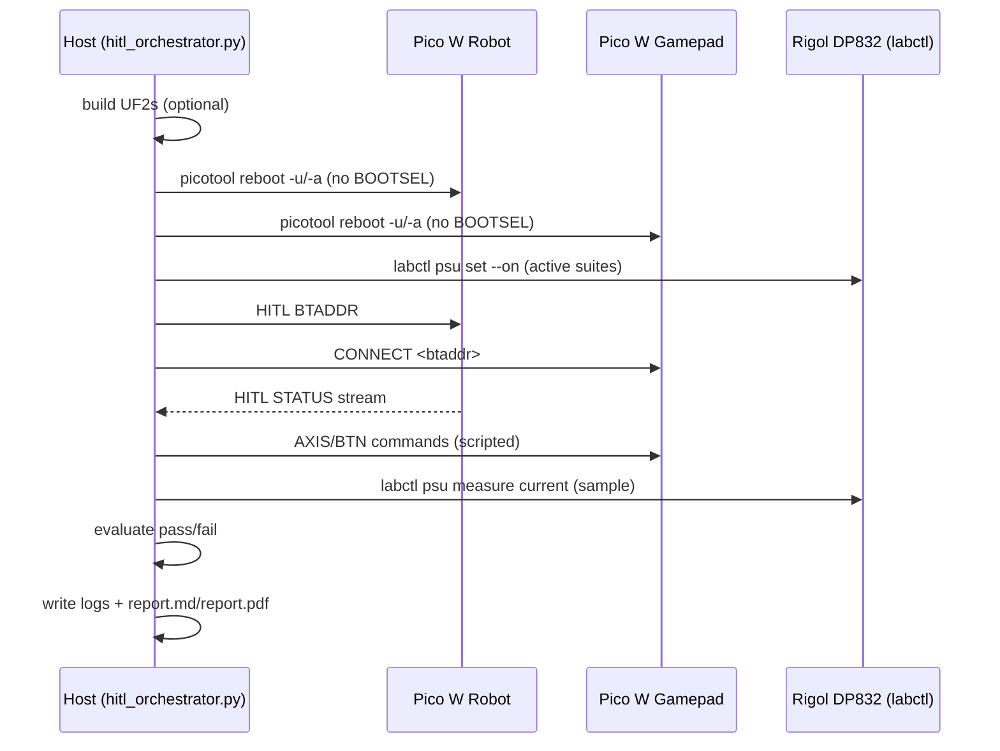
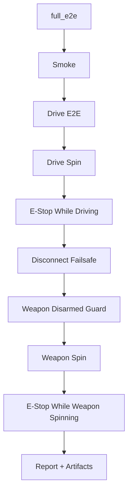
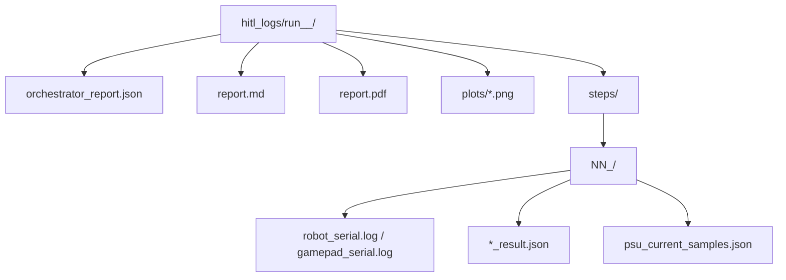

# ThumbsUp HITL (Hardware In The Loop)

This repo includes a fully automated HITL system that exercises the *production* competition firmware path end-to-end, without requiring a physical controller.

It uses:

- A **Robot Pico W** running the normal Bluetooth competition stack (Bluepad32) plus a USB HITL console.
- A **Gamepad Pico W** running a Bluetooth HID gamepad emulator controlled over USB serial.
- A host-side **orchestrator** that builds, flashes, runs pass/fail suites, and generates logs + reports.

## Architecture

```mermaid
flowchart LR
  subgraph Host[Host (Linux)]
    O[tools/hitl_orchestrator.py\nbuild/flash/run/report]
    L[labctl\nPSU/scope/USB hub]
  end

  subgraph Robot[Pico W: ThumbsUp HITL Robot]
    RUSB[USB CDC\nHITL Console]
    RBT[Bluetooth (Bluepad32)\nCompetition Input Path]
    RFW[Firmware\n(competition mode)]
    RDRV[Drive PWM\nGP0/GP1]
    RWEAP[Weapon DShot/PWM\nGP4]
  end

  subgraph Gamepad[Pico W: ThumbsUp HITL Gamepad]
    GUSB[USB CDC\nCommand Console]
    GBT[Bluetooth HID\nGamepad Emulator]
  end

  PSU[Bench PSU (Rigol DP832)\nCH1 -> motors/ESCs]
  ESCD[Drive ESC / Motors]
  ESCW[Weapon ESC + Motor]

  O -->|/dev/ttyHITL_ROBOT| RUSB
  O -->|/dev/ttyHITL_GAMEPAD| GUSB
  GBT -->|Bluetooth| RBT
  RFW --> RDRV --> ESCD
  RFW --> RWEAP --> ESCW
  L -->|USBTMC/TCP| PSU
  PSU --> ESCD
  PSU --> ESCW
```

### What "end-to-end" means here

The HITL path uses the same robot code that runs in competition:

- Bluepad32 connection lifecycle (connect, ready, disconnect, failsafe)
- Gamepad input parsing, deadzones, mixing, ramping
- Safety features (emergency stop, disarm on disconnect)

The only difference is that the controller is a scripted Pico W emulator instead of a human with a physical controller.

## Device Roles

- **Robot**: Pico W flashed with the HITL-enabled competition firmware.
- **Gamepad**: Pico W flashed with the controller emulator firmware.

The orchestrator expects stable device aliases:

- `/dev/ttyHITL_ROBOT`
- `/dev/ttyHITL_GAMEPAD`

See `docs/hitl_device_setup.md` for udev rules.

## Orchestrator Flow



## Running HITL

The entrypoint is:

```bash
python3 tools/hitl_orchestrator.py --suite <suite>
```

Common suites:

- `smoke`: connectivity + arming + failsafe state machine (safe, does not spin motors)
- `drive_e2e`: asserts the drive PWM outputs move and return to neutral (safe)
- `drive_spin`: requires PSU power; uses PSU current to confirm the drive motors actually spin (includes left-only/right-only checks)
- `disconnect_failsafe`: actively drives, disconnects controller, and asserts outputs go neutral quickly
- `estop_drive`: actively drives and asserts emergency-stop brings outputs + PSU current back to baseline
- `weapon_disarmed_guard`: commands weapon throttle while disarmed and asserts current does *not* rise
- `weapon_spin`: requires PSU power; spins weapon and validates via PSU current and (optionally) DShot telemetry
- `weapon_latency`: requires PSU power; measures controller->motor response latency using PSU current + robot status markers
- `estop_weapon`: spins weapon then asserts emergency-stop cuts it and current returns to baseline
- `safety_active`: runs the active safety invariants (estop drive + disconnect failsafe + weapon guard + estop weapon)
- `full_e2e`: runs the full suite (smoke + drive + safety + weapon)

Examples:

```bash
# Safe: no active spinning
python3 tools/hitl_orchestrator.py --suite smoke
python3 tools/hitl_orchestrator.py --suite drive_e2e
python3 tools/hitl_orchestrator.py --suite disconnect_failsafe

# Active: requires the PSU channel powering the motors/ESCs to be ON
python3 tools/hitl_orchestrator.py --suite drive_spin --psu-drive-channel 1
python3 tools/hitl_orchestrator.py --suite weapon_spin --psu-channel 1
python3 tools/hitl_orchestrator.py --suite estop_drive --psu-drive-channel 1
python3 tools/hitl_orchestrator.py --suite weapon_disarmed_guard --psu-channel 1
python3 tools/hitl_orchestrator.py --suite estop_weapon --psu-channel 1

# Full run
python3 tools/hitl_orchestrator.py --suite full_e2e --psu-channel 1 --psu-drive-channel 1
```

### `full_e2e` Flow



### Safety defaults

- Orchestrator defaults to turning PSU outputs **off** at the start of a run.
- Active suites explicitly enable PSU output (and will fail if current never rises).
- Use `--leave-psu-on` if you want the PSU left enabled after the suite.

## Reports And Artifacts

Every orchestrator invocation writes a single run directory:

- `hitl_logs/run_<timestamp>_<suite>/`

Key files:

- `orchestrator_report.json`: machine-readable pass/fail report
- `report.md`: human-readable report (includes inline plots)
- `report.pdf`: PDF report with the same plots + a summary page
- `steps/*/robot_serial.log`, `steps/*/gamepad_serial.log`: raw serial logs
- `steps/*/psu_current_samples.json`: sampled current with phase labels
- `plots/*.png`: generated plot images

Convenience pointer:

- `hitl_logs/latest_run_dir.txt`

### Run Directory Layout



## How The Tests Decide PASS/FAIL

Different checks are used depending on the subsystem:

- **Drive**:
  - Robot reports `dl_us` / `dr_us` (drive PWM pulses in microseconds).
  - Active drive tests also sample PSU current; a current delta above a threshold is treated as "motors really spun".
  - Left-only / right-only phases prevent false PASS when one motor is disconnected.
- **Weapon**:
  - Active weapon tests sample PSU current; optionally require DShot telemetry (`--require-telemetry`).
- **Safety**:
  - Emergency stop is verified by checking `failsafe=1`, outputs return to neutral/off, and current returns close to baseline.

## Extending HITL

The intended pattern is:

1. Add a new suite in `tools/hitl_orchestrator.py` that drives the gamepad emulator (`BTN`, `AXIS` commands).
2. Add robot-side introspection or overrides via `firmware/src/hitl_console.c` if needed.
3. Emit a `*_result.json` and any `psu_current_samples.json` for plotting.
4. Run the suite and validate the generated `report.pdf` and raw logs.

Related docs:

- `docs/HITL_ORCHESTRATION.md` (detailed component references and commands)
- `docs/hitl_device_setup.md` (udev aliases and stable device naming)
