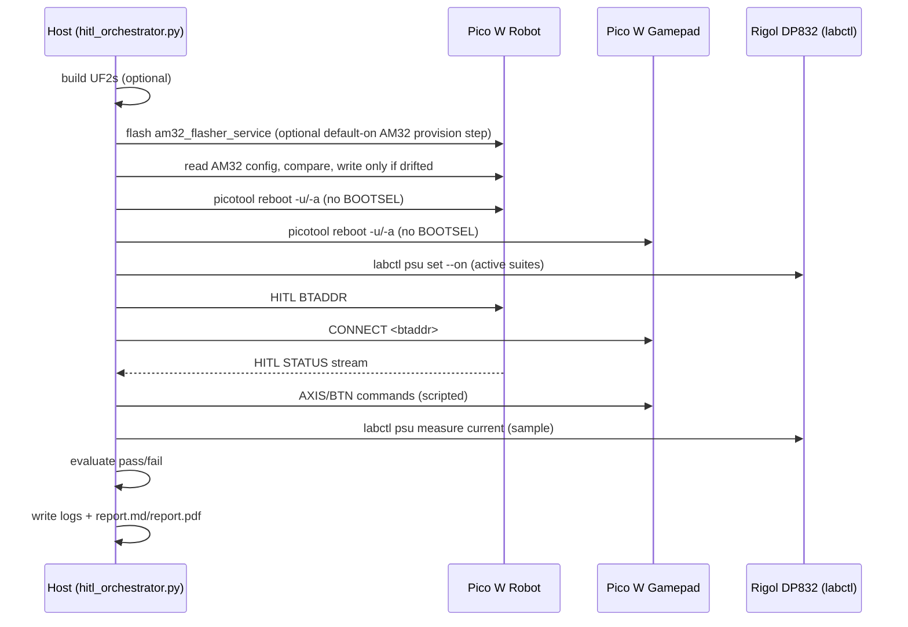
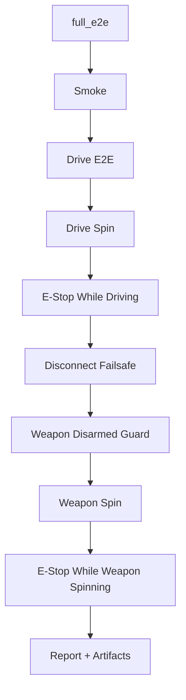
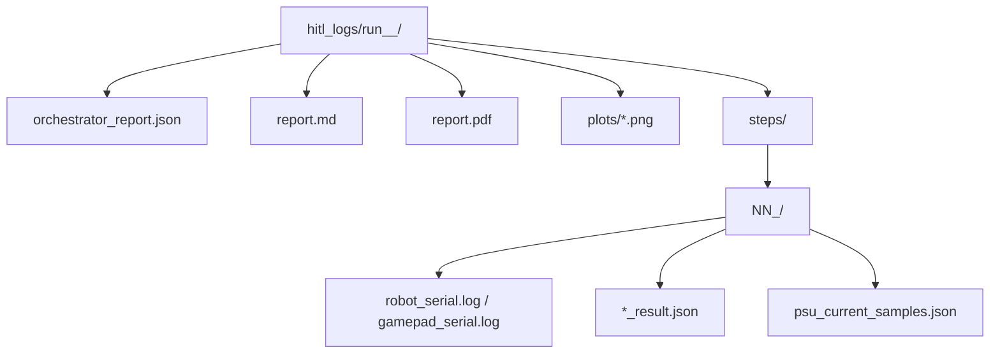

# ThumbsUp HITL (Hardware In The Loop)

This repo includes a fully automated HITL system that exercises the *production* competition firmware path end-to-end, without requiring a physical controller.

It uses:

- A **Robot Pico W** running the normal Bluetooth competition stack (Bluepad32) plus a USB HITL console.
- A **Gamepad Pico W** running a Bluetooth HID gamepad emulator controlled over USB serial.
- A host-side **orchestrator** that builds, flashes, runs pass/fail suites, and generates logs + reports.

## Architecture

```mermaid
flowchart LR
  subgraph Host[Host (Linux)]
    O[tools/hitl_orchestrator.py\nbuild/flash/run/report]
    L[labctl\nPSU/scope/USB hub]
  end

  subgraph Robot[Pico W: ThumbsUp HITL Robot]
    RUSB[USB CDC\nHITL Console]
    RBT[Bluetooth (Bluepad32)\nCompetition Input Path]
    RFW[Firmware\n(competition mode)]
    RDRV[Drive PWM\nGP0/GP1]
    RWEAP[Weapon DShot/PWM\nGP4]
  end

  subgraph Gamepad[Pico W: ThumbsUp HITL Gamepad]
    GUSB[USB CDC\nCommand Console]
    GBT[Bluetooth HID\nGamepad Emulator]
  end

  PSU[Bench PSU (Rigol DP832)\nCH1 -> motors/ESCs]
  ESCD[Drive ESC / Motors]
  ESCW[Weapon ESC + Motor]

  O -->|/dev/ttyHITL_ROBOT| RUSB
  O -->|/dev/ttyHITL_GAMEPAD| GUSB
  GBT -->|Bluetooth| RBT
  RFW --> RDRV --> ESCD
  RFW --> RWEAP --> ESCW
  L -->|USBTMC/TCP| PSU
  PSU --> ESCD
  PSU --> ESCW
```

### What "end-to-end" means here

The HITL path uses the same robot code that runs in competition:

- Bluepad32 connection lifecycle (connect, ready, disconnect, failsafe)
- Gamepad input parsing, deadzones, mixing, ramping
- Safety features (emergency stop, disarm on disconnect)

The only difference is that the controller is a scripted Pico W emulator instead of a human with a physical controller.

## Device Roles

- **Robot**: Pico W flashed with the HITL-enabled competition firmware.
- **Gamepad**: Pico W flashed with the controller emulator firmware.

The orchestrator expects stable device aliases:

- `/dev/ttyHITL_ROBOT`
- `/dev/ttyHITL_GAMEPAD`

See `docs/hitl_device_setup.md` for udev rules.

## Orchestrator Flow


```mermaid
sequenceDiagram
  participant Host as Host (hitl_orchestrator.py)
  participant Robot as Pico W Robot
  participant Pad as Pico W Gamepad
  participant PSU as Rigol DP832 (labctl)

  Host->>Host: build UF2s (optional)
  Host->>Robot: flash am32_flasher_service (optional default-on AM32 provision step)
  Host->>Robot: read AM32 config, compare, write only if drifted
  Host->>Robot: picotool reboot -u/-a (no BOOTSEL)
  Host->>Pad: picotool reboot -u/-a (no BOOTSEL)
  Host->>PSU: labctl psu set --on (active suites)
  Host->>Robot: HITL BTADDR
  Host->>Pad: CONNECT <btaddr>
  Robot-->>Host: HITL STATUS stream
  Host->>Pad: AXIS/BTN commands (scripted)
  Host->>PSU: labctl psu measure current (sample)
  Host->>Host: evaluate pass/fail
  Host->>Host: write logs + report.md/report.pdf
```

## Running HITL

The entrypoint is:

```bash
python3 tools/hitl_orchestrator.py --suite <suite>
```

By default, orchestrator also performs an `AM32 Provision` step before flashing competition firmware:

- Flashes `am32_flasher_service` to the robot Pico
- Best-effort enables `--psu-channel` so the ESC is powered during config checks
- Reads ESC config
- Compares to `config/am32/weapon_esc_expected.hexcfg`
- Writes only if different, then verifies via readback

Controls:

```bash
# Disable AM32 provisioning for a run
python3 tools/hitl_orchestrator.py --suite smoke --no-am32-provision

# Override expected config source
python3 tools/hitl_orchestrator.py --suite smoke --am32-config <path>
```

Common suites:

- `smoke`: connectivity + arming + failsafe state machine (safe, does not spin motors)
- `drive_e2e`: asserts the drive PWM outputs move and return to neutral (safe)
- `drive_spin`: requires PSU power; uses PSU current to confirm the drive motors actually spin (includes left-only/right-only checks)
- `disconnect_failsafe`: actively drives, disconnects controller, and asserts outputs go neutral quickly
- `disconnect_repair`: requires PSU power; spins weapon + drives, drops the controller link, asserts outputs go safe and PSU current returns to baseline, then requires the robot to re-discover and reconnect the emulator *on its own* (no emulator-initiated connect) and re-arm/spin afterwards. This is the path a real controller in pairing mode needs.
- `estop_drive`: actively drives and asserts emergency-stop brings outputs + PSU current back to baseline
- `weapon_disarmed_guard`: commands weapon throttle while disarmed and asserts current does *not* rise
- `weapon_spin`: requires PSU power; spins weapon and validates via PSU current and (optionally) DShot telemetry
- `weapon_latency`: requires PSU power; measures controller->motor response latency using PSU current + robot status markers
- `estop_weapon`: spins weapon then asserts emergency-stop cuts it and current returns to baseline
- `safety_active`: runs the active safety invariants (estop drive + disconnect failsafe + disconnect re-pair + weapon guard + estop weapon)
- `full_e2e`: runs the full suite (smoke + drive + safety + weapon)

Examples:

```bash
# Safe: no active spinning
python3 tools/hitl_orchestrator.py --suite smoke
python3 tools/hitl_orchestrator.py --suite drive_e2e
python3 tools/hitl_orchestrator.py --suite disconnect_failsafe

# Active: requires the PSU channel powering the motors/ESCs to be ON
python3 tools/hitl_orchestrator.py --suite drive_spin --psu-drive-channel 1
python3 tools/hitl_orchestrator.py --suite weapon_spin --psu-channel 1
python3 tools/hitl_orchestrator.py --suite estop_drive --psu-drive-channel 1
python3 tools/hitl_orchestrator.py --suite weapon_disarmed_guard --psu-channel 1
python3 tools/hitl_orchestrator.py --suite estop_weapon --psu-channel 1

# Full run
python3 tools/hitl_orchestrator.py --suite full_e2e --psu-channel 1 --psu-drive-channel 1
```

### `full_e2e` Flow


```mermaid
flowchart TD
  A[full_e2e] --> S[Smoke]
  S --> D1[Drive E2E]
  D1 --> D2[Drive Spin]
  D2 --> ED[E-Stop While Driving]
  ED --> DF[Disconnect Failsafe]
  DF --> WG[Weapon Disarmed Guard]
  WG --> W1[Weapon Spin]
  W1 --> EW[E-Stop While Weapon Spinning]
  EW --> R[Report + Artifacts]
```

### Safety defaults

- Orchestrator defaults to turning PSU outputs **off** at the start of a run.
- Active suites explicitly enable PSU output (and will fail if current never rises).
- Use `--leave-psu-on` if you want the PSU left enabled after the suite.

## Reports And Artifacts

Every orchestrator invocation writes a single run directory:

- `hitl_logs/run_<timestamp>_<suite>/`

Key files:

- `orchestrator_report.json`: machine-readable pass/fail report
- `report.md`: human-readable report (includes inline plots)
- `report.pdf`: PDF report with the same plots + a summary page
- `steps/*/robot_serial.log`, `steps/*/gamepad_serial.log`: raw serial logs
- `steps/*/am32_provision_result.json`: AM32 drift-check/apply summary (if provision step enabled)
- `steps/*/config_before.bin`, `steps/*/config_after.bin`: AM32 config snapshots
- `steps/*/psu_current_samples.json`: sampled current with phase labels
- `plots/*.png`: generated plot images

Convenience pointer:

- `hitl_logs/latest_run_dir.txt`

### Run Directory Layout


```mermaid
flowchart TB
  Run[hitl_logs/run_<timestamp>_<suite>/]
  Run --> OR[orchestrator_report.json]
  Run --> MD[report.md]
  Run --> PDF[report.pdf]
  Run --> Plots[plots/*.png]
  Run --> Steps[steps/]
  Steps --> Step[NN_<step_name>/]
  Step --> Logs[robot_serial.log / gamepad_serial.log]
  Step --> JSON[*_result.json]
  Step --> PSU[psu_current_samples.json]
```

## How The Tests Decide PASS/FAIL

Different checks are used depending on the subsystem:

- **Drive**:
  - Suites command throttle on the left stick (`AXIS LY`) and turn on the right stick (`AXIS RX`, `--drive-turn-axis`).
  - Robot reports `dl_us` / `dr_us` (drive PWM pulses in microseconds).
  - Active drive tests also sample PSU current; a current delta above a threshold is treated as "motors really spun".
  - Left-only / right-only phases prevent false PASS when one motor is disconnected.
- **Weapon**:
  - The weapon is driven with the emulator triggers (`BTN R2 1` forward, `BTN L2 1` reverse, release both to stop) at a fixed 100%; suites release both triggers after arming because the firmware needs a release edge before a press counts. `--spin-axis` / `--guard-axis` / `--zero-cross-axis` / `--soak-axis` only select direction now (magnitude ignored).
  - Active weapon tests sample PSU current; optionally require DShot telemetry (`--require-telemetry`).
- **Safety**:
  - Emergency stop is verified by checking `failsafe=1`, outputs return to neutral/off, and current returns close to baseline.

## H-Bridge Drive Suite (`tools/hitl_drive_hb.py`)

Demonstrates each DRV8874 drive capability against independent ground truth.
It runs against the flashed `thumbsup_hitl.uf2` (no build/flash step) with
the wheels free to spin.

```bash
./tools/hitl_drive_hb.py --list
./tools/hitl_drive_hb.py all                 # ~25 min
./tools/hitl_drive_hb.py speed_estimate health_match
```

Artifacts go to `hitl_logs/drive_hb_<stamp>/`: `results.json` (every check and
its measured numbers), robot/emulator logs, and every M2K capture (`.npz`).

### M2K wiring

| M2K | Signal |
|-----|--------|
| DIO0 | emulator GP15 (HID-send marker), currently not reading correctly, see below |
| DIO1 | robot GP15 (report-received marker) |
| DIO2 / DIO3 | robot GP0 / GP1, left IN1 / IN2 |
| DIO4 | robot GP4, weapon DShot |
| DIO5 / DIO6 | robot GP2 / GP3, right IN1 / IN2 |
| DIO7 | robot GP6, DRV8874 SLEEP |
| CH1 (+1/−1) | across the left motor (OUT1 / OUT2) |
| CH2 (+2/−2) | across the right motor |

`tools/m2k_hb_worker.py` runs the M2K (labctl venv) and does the analysis.
Two M2K facts the analysis has to handle:
- **Lag:** analog samples lag digital ones by ~5.2–5.7 ms, varying per capture,
  even with mixed-signal start. Coast windows are therefore located in the
  analog trace itself.
- **Gain/offset:** the ±25 V inputs read ~5% low with a ~0.5 V offset. The suite
  calibrates both channels at the start from the forward/reverse PWM rail levels
  against the PSU voltage.

### Ground truth

| What | Truth |
|------|-------|
| Wheel speed | Back-EMF across the motor during a short coast (`HITL DRVPROBE`), extrapolated back to the start of the coast |
| Output timing / duty / sleep | H-bridge input pins and SLEEP on the M2K logic inputs |
| Current | PSU supply current (= quiescent + duty × motor current in slow decay) |
| Battery | PSU voltage |

### Tests

| Test | Shows |
|------|-------|
| direction | each motor both ways: 20 kHz, exact duty on the pins, motor voltage = duty × supply |
| stick_mapping | sticks → wheels: forward, back, both spin turns, proportional |
| latency | report received → H-bridge output (0.2 ms) |
| brake_vs_coast | released wheel at 2% speed after 150 ms braking vs 37% coasting |
| sleep | asleep with no controller (commands ignored), awake when ready |
| fault | undervoltage (PSU 3.8 V) reported on nFAULT, clears, drive recovers |
| current_sense | current sense agrees with the PSU |
| speed_estimate | estimate vs truth, both motors, ±15–100%, within 0.6 V |
| speed_dynamic | estimate tracks a wheel accelerating from rest |
| resistance_cal | R measured on starts from rest and drive→brake transitions, consistent within 20% |
| accel_limit | 200 %/s ramp as specified; release still instant |
| battery | divider accuracy 9–15 V; low/critical alerts with hysteresis; drive unaffected; arming refused < 9.6 V |
| current_limit | full-speed reversal hits the DRV8874 current limit, reported, no lockout |
| health_detect | damaged gearbox flagged, healthy side not |
| health_match | speed matching on the damaged gearbox: mismatch 26% → <5% |
| health_simulated | `DRVDERATE` 55% loss on the left: detected, right trimmed to the 60% floor, mismatch reduced |

The rig's right gearbox is genuinely damaged (it drags hard above ~50% and
varies from moment to moment), which is why health tests use it.

Not verifiable on the rig:
- **Controller rumble:** the emulator is a generic HID gamepad, so the console
  logs whether the rumble request went out but nothing feels it.
- **The GP9 status LEDs:** no M2K input is spare.
- **Current limiting under real wheel load:** the wheels spin free; only the
  reversal case is tested.

Emulator-to-robot (Bluetooth) latency needs DIO0 to follow the emulator's GP15
marker. On 2026-10-02 DIO0 toggled with sticks at neutral, so it isn't
connected to that marker at the moment.

## Extending HITL

The intended pattern is:

1. Add a new suite in `tools/hitl_orchestrator.py` that drives the gamepad emulator (`BTN`, `AXIS` commands).
2. Add robot-side introspection or overrides via `firmware/src/hitl_console.c` if needed.
3. Emit a `*_result.json` and any `psu_current_samples.json` for plotting.
4. Run the suite and validate the generated `report.pdf` and raw logs.

Related docs:

- `docs/HITL_ORCHESTRATION.md` (detailed component references and commands)
- `docs/hitl_device_setup.md` (udev aliases and stable device naming)
